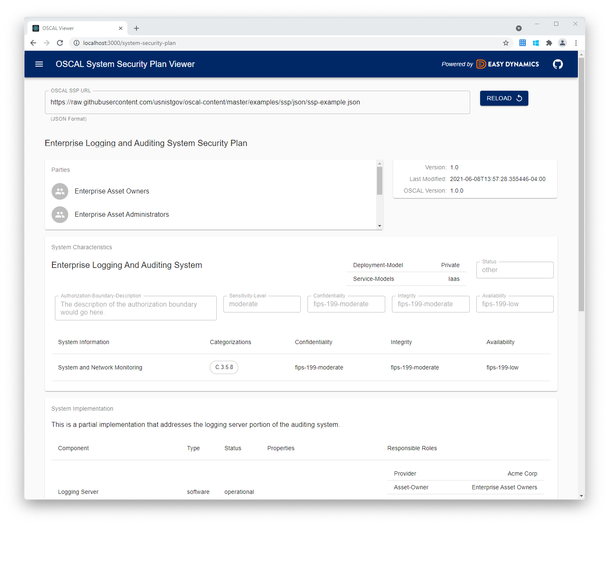

# OSCAL React Library

A library of React components and an [example application](/packages/oscal-viewer) that provides
a direct view into NIST's Open Security Controls Assessment Language ([OSCAL](https://pages.nist.gov/OSCAL/)) data
in JSON format.

These components enable React application developers to quickly compose pages that display granular elements of
OSCAL data or entire catalogs, profiles, component definitions, and system security plans.


Take a tour with the [live demo](https://oscal-viewer.msd.easydynamics.com/) or learn more about
developing with the library below.

## Components and Documentation

The library provides OSCAL UI developers a flexible framework for using OSCAL React components in their own
applications.

Those components directly visualize granular elements of the OSCAL JSON format, allowing a developer to assemble them
in the manner that best fits their application.

Documentation for the React components, as well as an editable mockup of each component, can be found on our
[Storybook page](https://docs.oscal-react-library.msd.easydynamics.com/).

The [viewer appplication](./packages/oscal-viewer/) shows how those components can be assembled
to create an OSCAL Viewer application.

## Setting Up

### Building and Running Locally

In order to use the library components or test the library locally, the project components need to be rolled up and
dependencies need to be installed initially with the command: `npm ci`. From here the application can be built
(See "OSCAL Viewer → Running") or components can be tested (See "Testing"). To automate local installation and
immediately run the application, use the following command:

```bash
./scripts/watch-viewer
```

### Testing

To run the test suite, ensure dependencies are installed and run `npm run test`. To also validate code is passing
eslint linting requirements, run `npm run lint`.

### Development

Development on the library primarily takes place in `packages/oscal-react-library`. React components
are added in that package. Paths in this section are relative to that directory.

A component can be created and added to `src/components`. In order for the component to be used in an application,
it must either be added as an export in `src/index.js` or referenced by a component already being exported start(such as
components being referenced by a loader in the current OSCAL Viewer). In the root folder of the project, run
`npm run watch` to roll up all of the components into `dist/` making them accessible to the example application.

## OSCAL Viewer (Example Application)

The OSCAL Viewer example application allows developers to sample the various OSCAL concepts and view their features.

### Running

Once root dependencies are installed, build application dependencies and run OSCAL Viewer with the following
command:

```bash
./scripts/watch-viewer
```

For more details about OSCAL Viewer, please refer to the
[example (OSCAL Viewer) README.md](/packages/oscal-viewer/README.md).

### Google Analytics

The OSCAL Viewer example application includes an optional integration for Google Analytics. Google
Analytics is enabled only when `REACT_APP_GOOGLE_ANALYTICS` is set to a Google Analytics GA4
identifier when `npm run build` is run. For example:

```bash
export REACT_APP_GOOGLE_ANALYTICS="G-XXXXXXXXXX"`
npm run build
```

will produce an application build with Google Analytics tracking enabled. The only way to toggle
Google Analytics or change the tracking ID is to rebuild the application.

## Experimental REST Features

To enabled experimental features that make REST calls defined in
[`oscal-rest`](https://github.com/EasyDynamics/oscal-rest) to a backend service, add a
new environment variable setting the base rest url in the directory you are running the
Viewer from.

```bash
export REACT_APP_REST_BASE_URL=http://localhost:8080/oscal/v1
./scripts/watch-viewer
```

## Contributing

For the process of Contributing to the project, please review
[CONTRIBUTING.md](https://github.com/EasyDynamics/.github/blob/main/CONTRIBUTING.md)
and adhere to the
[Code of Conduct](https://github.com/EasyDynamics/.github/blob/main/CODE_OF_CONDUCT.md).

## Licensing

For information on the project's license, please review the [LICENSE](/LICENSE) file.
