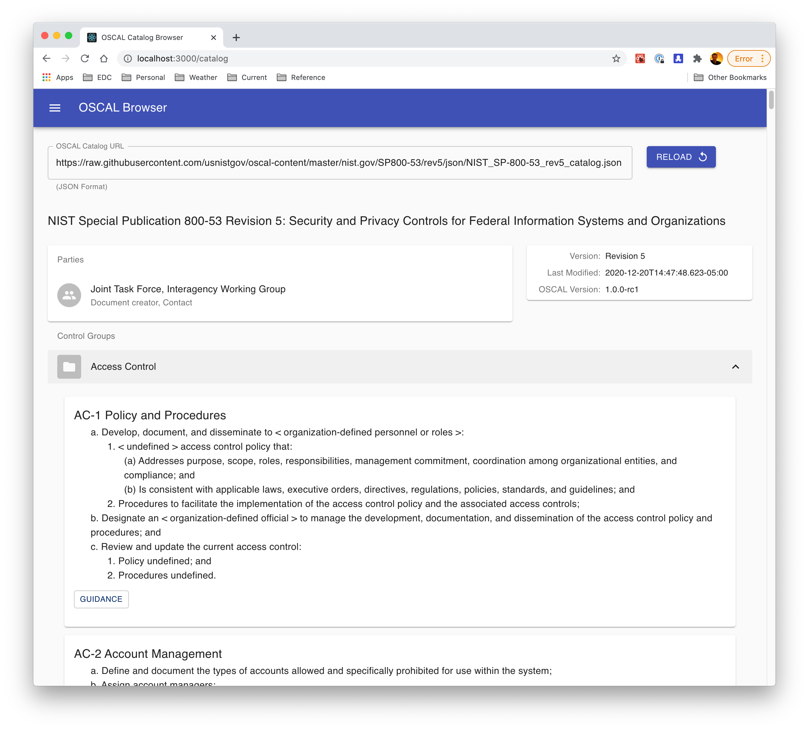
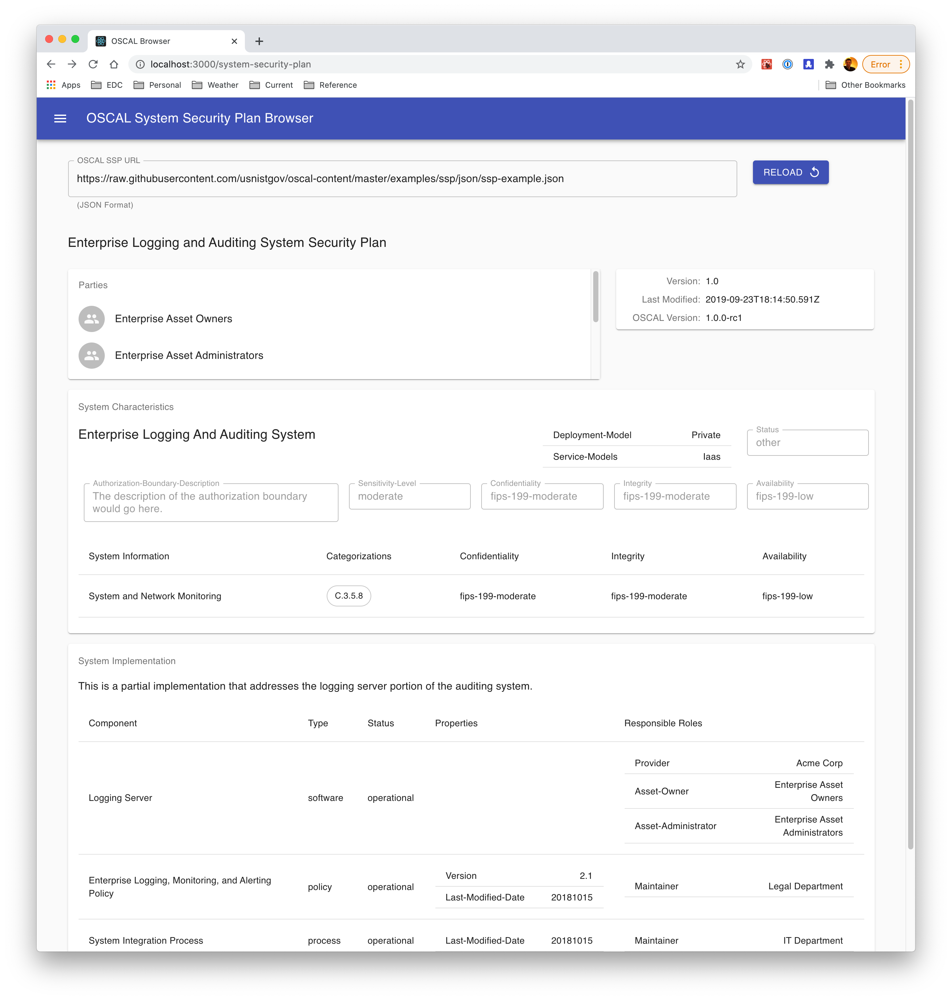

# Easy Dynamics OSCAL Browser

A React-based UI for browsing OSCAL data.

## Features
In this initial iteration the project is only able to browse basic elements of OSCAL catalog and system security plan definitions.

The NIST 800-53 (rev 5) catalog is loaded by default in the catalog browser:



The ssp-example from the OSCAL Github repo is loaded by default in the SSP browser:



## Running

```
npm install
npm start
```
