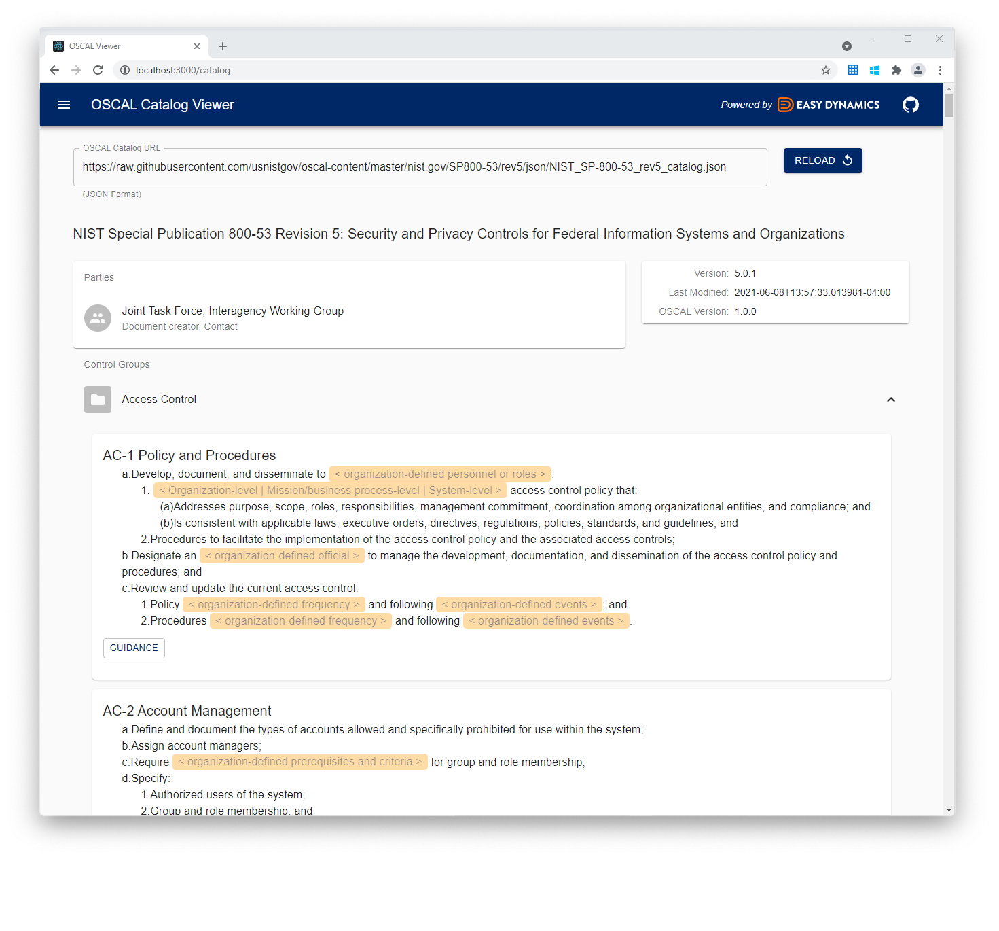
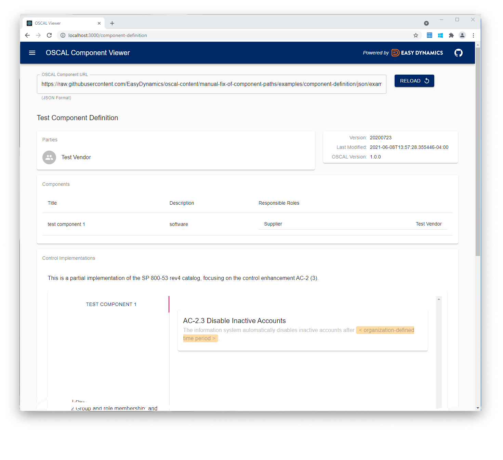
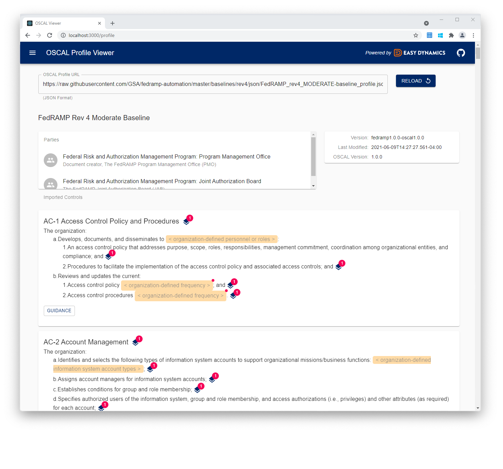

# Easy Dynamics OSCAL Viewer

The OSCAL Viewer sample application is a React-based UI used for browsing OSCAL data. It is provided both as an
example of using OSCAL React components and as a tool to view the complex OSCAL data concepts in an easily
comprehensive format.

An open sandbox environment of the project can be viewed at https://oscal-viewer.msd.easydynamics.com/catalog.


## Features
In this initial iteration, the project renders basic elements of OSCAL catalogs, system security plans, component
definitions, and profiles.

The NIST 800-53 (rev 5) catalog is loaded by default in the catalog viewer:



The ssp-example from the OSCAL Github repo is loaded by default in the SSP viewer:


An Easy Dynamics component definition is loaded by default in the component viewer:



The NIST 800-53 (rev 4) profile is loaded by default in the profile viewer:




## Running

When in `example/`, the following commands can be issued:

```
npm install
npm start
```

## Testing

Within the `example/src` directory, run the following commands to run application tests and linter checks, respectively:

```
npm run test
npm run lint
```

For details on building the project and running it in the root project directory see "Development" and "OSCAL Viewer" → "Running" in the [OSCAL React Libraries README.md](../README.md).

