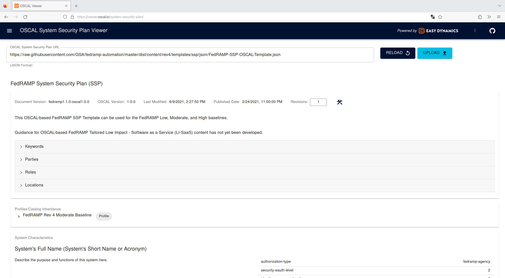

# Easy Dynamics OSCAL Viewer

The OSCAL Viewer sample application is a React-based UI used for browsing OSCAL data. It is provided both as an
example of using OSCAL React components and as a tool to view the complex OSCAL data concepts in an easily
comprehensive format.

An open sandbox environment of the project can be viewed at
[https://viewer.oscal.io/catalog](https://viewer.oscal.io/catalog).

## Features

In this initial iteration, the project renders basic elements of OSCAL catalogs, profiles, component
definitions, and system security plans.

The NIST 800-53 (rev 5) catalog is loaded by default in the catalog viewer:

The NIST 800-53 (rev 5) profile is loaded by default in the profile viewer:

An Easy Dynamics component definition is loaded by default in the component viewer:

The FedRAMP SSP template is loaded by default in the system security plan viewer:

